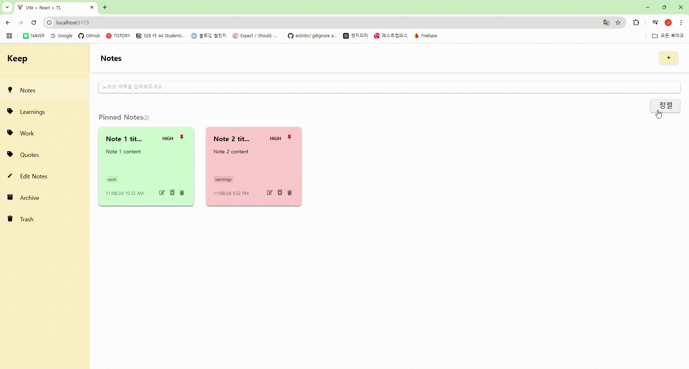
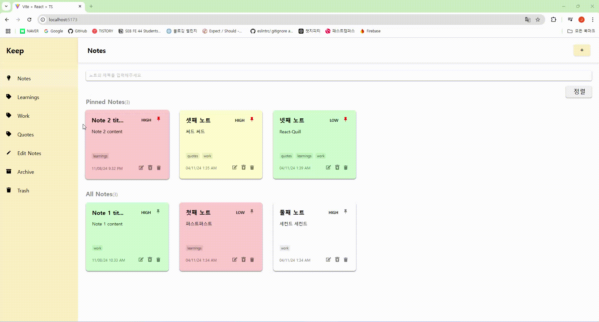
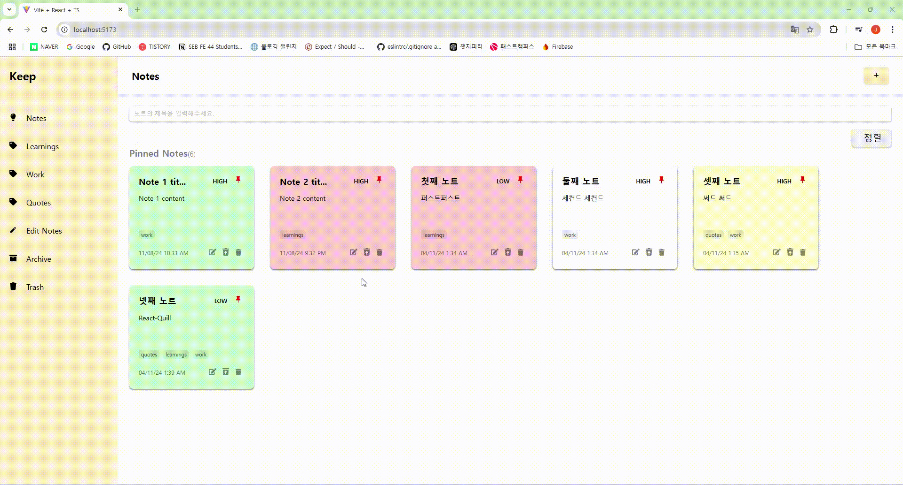

<h1> Notes 만들기 </h1>

<br>

- **배포 링크 :** [Notes링크](채워넣기)

<br>

## 페이지 설명 :
 > Google Keep을 모티브로 메모, 체크리스트, 사진 등을 쉽게 기록하고 관리할 수 있는 앱을 제작했습니다.

 > 사이트는 단일 페이지로, **Tag, Pin, Archive, Trash** 등 상태에 따라 노트를 보관할 수 있습니다.

<br><br>

| Note Add | Note Tag Edit |
|:---:|:---:|
|||
| **Note Sort** | **Note Redux** |
|||


<br><br>

## 기술 스택

|       vite       |     react     | Typescript | 
| :--------------: | :-----------: | :--------: | 
| styled-component | Redux/toolkit |  Netlify   |  

<br><br>

## 사용한 라이브러리 & 구현 기능

<br>

- ## 라이브러리 :
 > ## [React Router Dom](https://reactrouter.com/en/main/start/tutorial)
  페이지 전환을 도와주는 라이브러리 입니다.

 ```javascript
 import { BrowserRouter, Navigate, Route, Routes } from "react-router-dom";

    <BrowserRouter>
      <Routes>
        <Route path="/" element={<AllNotes />} />
        <Route path="/archive" element={<ArchiveNotes />} />
        <Route path="/trash" element={<TrashNotes />} />
        <Route path="/tag/:name" element={<TagNotes />} />
        <Route path="/404" element={<ErrorPage />} />
        <Route path="/*" element={<Navigate to={"/404"} />} />
      </Routes>
    </BrowserRouter>

 ```

<br><br>


> ## [Redux/toolkit](https://redux-toolkit.js.org/introduction/getting-started)

전역 저장소 생성을 지원해주는 라이브러리입니다.

<br>

```javascript
(npm install @reduxjs/toolkit)

//step1. 통합 store 생성
import { configureStore } from "@reduxjs/toolkit";
import menuReducer from "./menu/menuSlice";
/*import modalReducer from "./modal/modalSlice";
import notesListReducer from "./notesList/notesListSlice";
import tagsReducer from "./tags/tagsSlice";*/

export const store = configureStore({
  reducer: {
    menu: menuReducer,
    //step4. store에 slice 추가

    /*modal: modalReducer,
    notesList: notesListReducer,
    tags: tagsReducer,*/
  },
});

export type RootState = ReturnType<typeof store.getState>;
export type AppDispatch = typeof store.dispatch;
```

<br>

```javascript
//step2. 저장소 전역 설정
import { store } from "./store/index.ts";
import { Provider } from "react-redux";

ReactDOM.createRoot(document.getElementById("root")!).render(
  <Provider store={store}>
    <App />
  </Provider>
);
```

<br>

```javascript
///step3. slice 생성
import { createSlice } from "@reduxjs/toolkit";

interface MenuState {
  isOpen: boolean;
}

const initialState: MenuState = {
  isOpen: false,
};

const menuSlice = createSlice({
  name: "menu",
  initialState,
  reducers: {
    toggleMenu: (state, action) => {
      state.isOpen = action.payload;
    },
  },
});

export const { toggleMenu } = menuSlice.actions;
export default menuSlice.reducer;
```

<br>
step4.는 step1. 내용에 있습니다.
<br>
<br>

```javascript
//step5. slice에서 reducers를 가져와 사용
import { toggleMenu } from "../../store/menu/menuSlice";

<ItemsBox>
<li onClick={() => dispatch(toggleMenu(false))}>
<ItemsBox>
```

<br><br>

> ## [react-quill](https://github.com/zenoamaro/react-quill)
 폰트 색 변경, 크기 조정, 이미지 추가 등의 기능을 사용할 수 있는 텍스트 에디터 라이브러리 입니다.
 <br>
 텍스트 에디터를 원하는 대로 커스텀 할 수 있습니다.


 ```javascript
 import ReactQuill from "react-quill";
 import "react-quill/dist/quill.snow.css";

 // ReactQuill Custom
 const formats = [
  "bold",
  "italic",
  "underline",
  "strike",
  "list",

  "color",
  "background",

  "image",
  "blockquote",
  "code-block",
 ];

 const modules = {
   toolbar: [
    [{ list: "ordered" }, { list: "bullet" }],
    [],
    ["italic", "underline", "strike"],
    [],
    [{ color: [] }, { background: [] }],
    [],
    ["image", "blockquote", "code-block"],
   ],
 };

 // ReactQuill 사용
 const TextEditor = ({ color, value, setValue }: TextEditorProps) => {
  return (
   ..
      <ReactQuill
        formats={formats}  // React-Quill 커스텀
        modules={modules}
        theme="snow"
        value={value}  //prop으로 가져온 입력값
        onChange={setValue}
      />
  );
};

 ```
<br><br>

> ## [html-react-parser](https://www.npmjs.com/package/html-react-parser)
  HTML string을 React Element로 변환해 주는 라이브러리 입니다.
  <br>
  React-Quill 텍스터 에디터에서, HTML요소를 포함한 데이터를 일반적인 텍스트로 바꿔주기 위해 사용했습니다.

  <br>

  ```javascript 
  import parse from "html-react-parser";

  // html-react-parser 예시1
  parse ( '<p>Hello, World!</p>' ) ;  // React.createElement('p', {}, 'Hello, World!')

  // html-react-parser 예시2
  <div className="readNote__content">{parse(note.content)}</div>  

  /*ex) 노트에 "Text" 입력시 , 
  BEFORE : <p>Text<p>
  AFTER : Text                */

  ```

<br><br>

> ## [React-Toastify](https://fkhadra.github.io/react-toastify/introduction/)

 알림창 생성을 지원해주는 라이브러리입니다.

 <br>

```Typescript
(npm install --save react-toastify)
import { toast } from "react-toastify";

  const createNoteHandler = () => {
    if (!noteTitle) {
      toast.error("타이틀을 적어주세요");
      return;
    } else if (value === "<p><br></p>") {
      toast.error("글을 작성해주세요");
      return;
    }
  }

```

<br><br>

> ## [uuid](https://www.npmjs.com/package/uuid)

 uuid란 범용 고유 식별자입니다.

```Typescript

(npm install uuid)

import { v4 } from "uuid";

  const tagsHandler = (tag: string, type: string) => {
    const newTag = tag.toLocaleLowerCase();

    if (type === "add") {
      setAddedTags((prev) => [...prev, { tag: newTag, id: v4() }]);//version 4의 고유 식별자 생성
    } else {
      setAddedTags(addedTags.filter(({ tag }) => tag !== newTag));
    }
  };


```

<br><br>

> ## [dayjs](https://day.js.org/docs/en/installation/typescript)

 현재의 시간을 사용할 수 있게 도와주는 라이브러리로 연도부터 월, 일, 시간(초까지) 표기됩니다.

```Typescript
(npm install dayjs)
 import dayjs from "dayjs";

 const date = dayjs().format("DD/MM/YY h:mm A");

```

<br>

<br>

